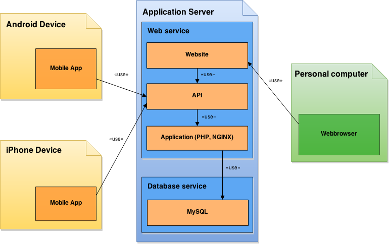

## 4.1. Packagestructuur

Het onderstaande diagram geeft weer hoe de verschillende deelsystemen verband houden met elkaar:

Dit diagram geeft weer hoe de mobiele applicatie interacteert met de API en hoe een gebruiker via een webbrowser gebruik kan maken van de wbsite. De onderliggende laag, met name de applicatielaag, biedt alle functionaliteiten en presenteert de (MySQL) database gegevens, aan de API en de website, in het vereiste formaat.
