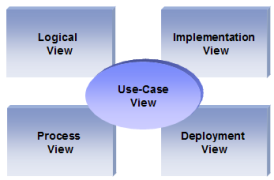

## 1.1. Doel van dit document
Dit document is geschreven om de architectuur te beschrijven van het Wobbe 2000 systeem, dat ontwikkeld is voor supermarktketen _Wobbe_. Om de verschillende aspecten van het systeem zo duidelijk mogelijk te belichten, zal het systeem beschreven worden vanuit een aantal verschillende architecturele views. De verschillende RUP views zijn uitgewerkt op basis van het RUP 4+1 model.

Het 4+1 view model stelt de verschillende belanghebbenden in staat om vanuit hun eigen perspectief de invloed van de gekozen architectuur te bepalen. De Process View (communicatie van processen) is niet als los hoofdstuk uitgewerkt, maar ondergebracht bij de hoofdstukken 3.3 en 5.
