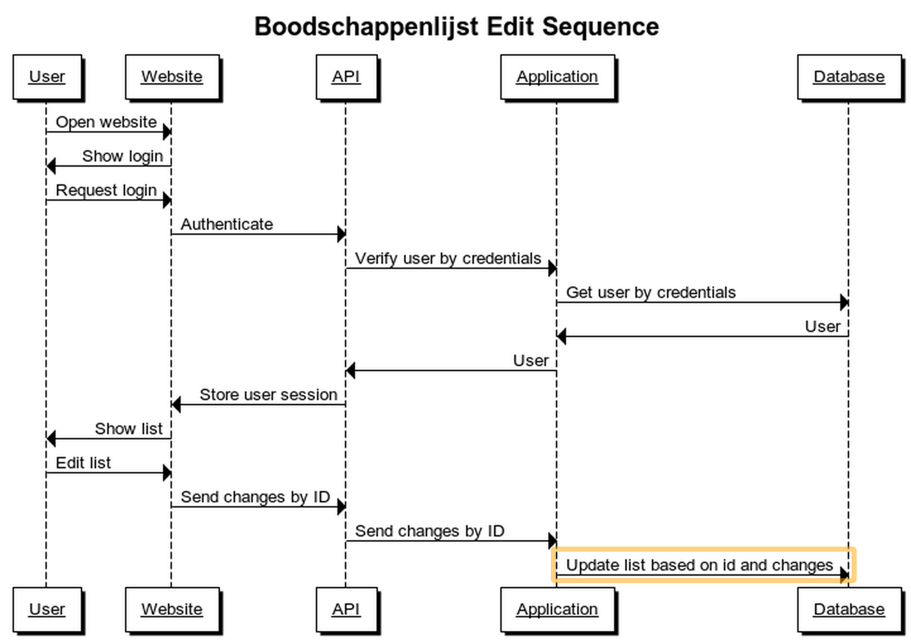

# 3. Logical View

Deze sectie beschrijft de architectureel significante logische opbouw van het systeem.

## 3.1. Lagen

De opbouw van het systeem kan worden onderverdeeld in vier lagen.

| Laag | Doel |
| --- | --- |
| __Presentatie__ | De grafische interface voor de interactie met de eindgebruikers. |
| __Service__ | Het communiceren tussen de presentatielaag en de domeinlaag. Dit wordt gedaan m.b.v. een API. |
| __Domein__ | De applicatielogica, zoals het presenteren en verwerken van gegevens. |
| __Data__ | Het aanbieden en persisteren van gebruikersdata. |

## 3.2. Deelsystemen

Het systeem bestaat uit drie deelsystemen, namelijk:

| Deelsystemen | Doel |
| --- | --- |
| __Smartphone__ | Dit apparaat heeft de app geinstalleerd. Hiermee kan de gebruiker acties uitvoeren op het systeem. |
| __Personal Computer__ | Met behulp van de web browser kan de gebruiker inloggen op de website. Op de website kan de gebruiker een lijst aanmaken, aanpassen en verwijderen. |
| __Webserver__ | Dit systeem verzorgt de API, die tevens wordt gebruikt door de mobiele app en de website. De website wordt aangeboden vanaf deze server. |

## 3.3. Realisatie van functionele eisen

De hoofdfunctionaliteit van het systeem bestaat uit het bekijken en aanpassen van een boodschappenlijstje. Onderstaande sequence diagrammen beschrijven zowel het bekijken van een boodschappenlijst via de mobiele app als het aanpassen van een boodschappenlijst via de website.

Deze afbeelding beschrijft het bekijken van een boodschappenlijst via de mobiele app.

Deze afbeelding beschrijft het aanpassen van een boodschappenlijst via de website.
